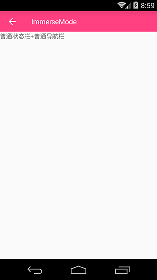
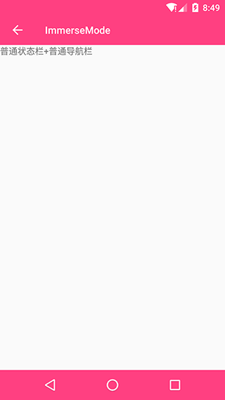
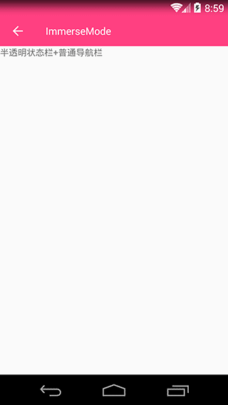
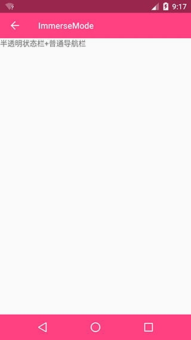
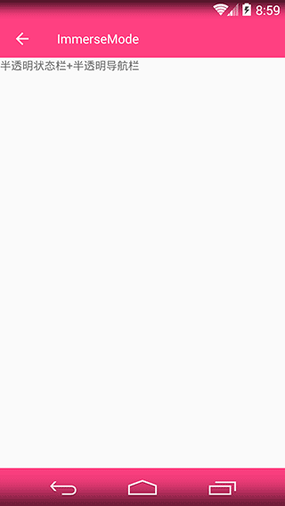
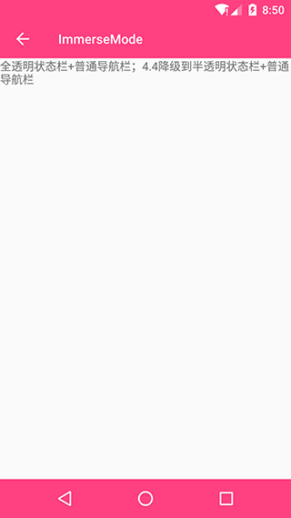
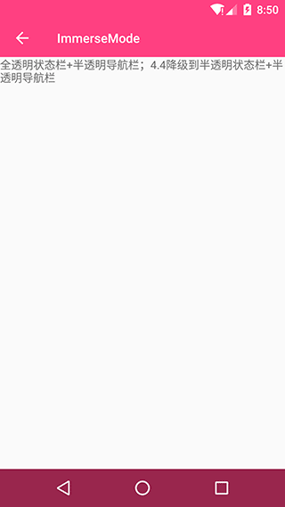
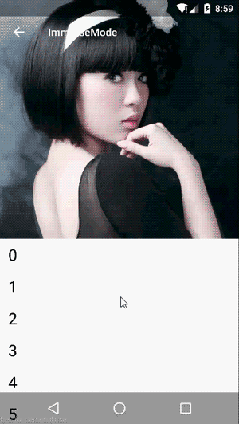

# ImmerseMode

## Brief

跟随当前Android App沉浸趋势，提供状态栏沉浸解决方案，支持状态栏变色以及内容延伸至状态栏的全屏显示。提供一套侵入性最低的工具类解决方案以及一套基类Activity解决方案（待补充）

## DEMO

### 状态栏着色

|模式/版本|4.3及以下|4.4|5.0及以上|
|:-:|:-:|:-:|:-:|
|普通模式||||
|半透状态栏+普通导航栏|不支持|||
|半透状态栏+半透导航栏|不支持|||
|全透状态栏+普通导航栏|不支持|不支持||
|全透状态栏+半透导航栏|不支持|不支持||

### 内容全屏

|模式/版本|4.3及以下|4.4|5.0及以上|
|:-:|:-:|:-:|:-:|
|普通模式||-|-|
|半透状态栏+普通导航栏|-|||
|半透状态栏+半透导航栏|-|||
|全透状态栏+普通导航栏|-|-||
|全透状态栏+半透导航栏|-|-||

## Feature

- 提供两套状态栏沉浸解决方案，一套侵入性最低的工具类解决方案，一套BaseActivity。如果在旧的项目上开发，推荐使用工具类解决方案；如果开发新的业务，推荐使用BaseActivity解决方案
- 本项目借鉴了[StatusBarHelper][0]项目，但该项目在5.0以上系统状态栏着色的几种实现方式上存在一些属性设置冗余的问题，容易给初学者造成一些混淆，正巧我手头一个项目需要做状态栏沉浸处理，因此顺手进行了一版实现，以求给大家最直接最原始的实现，共勉和学习。

[0]:https://github.com/naturs/StatusBarHelper
